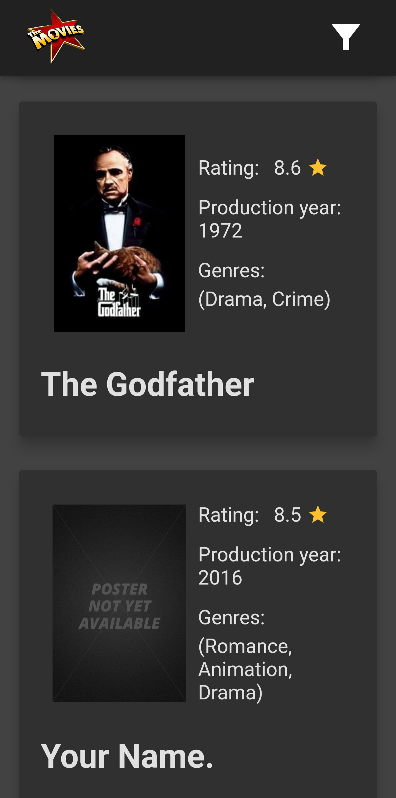
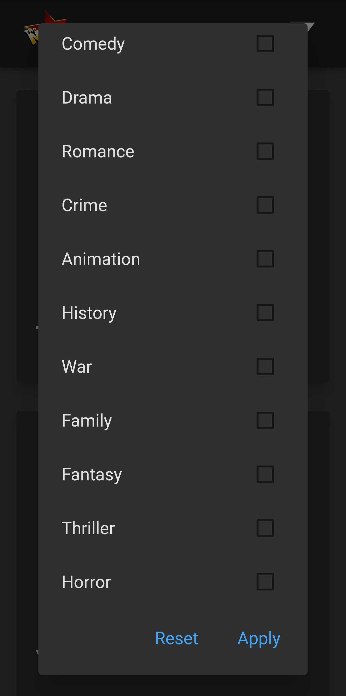
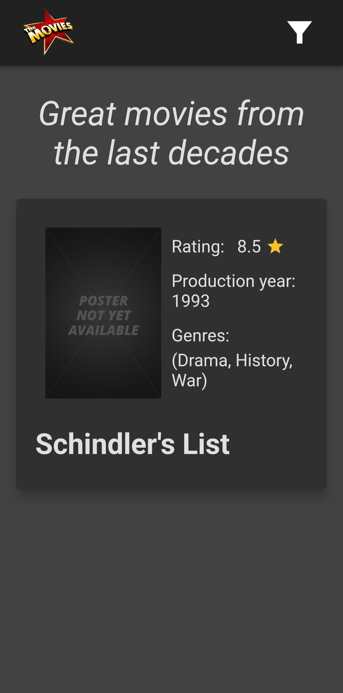
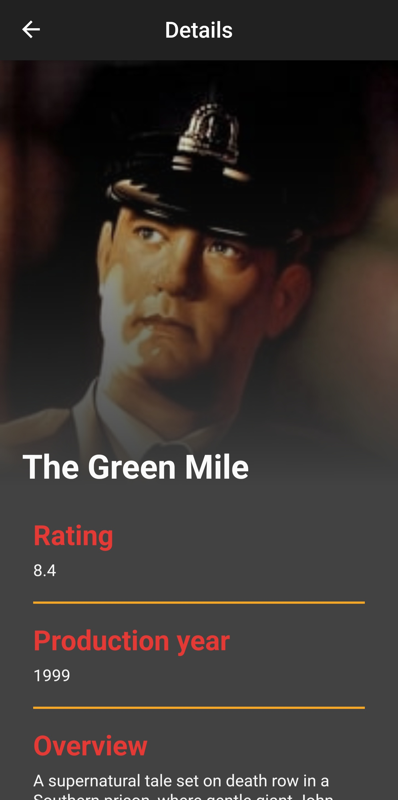
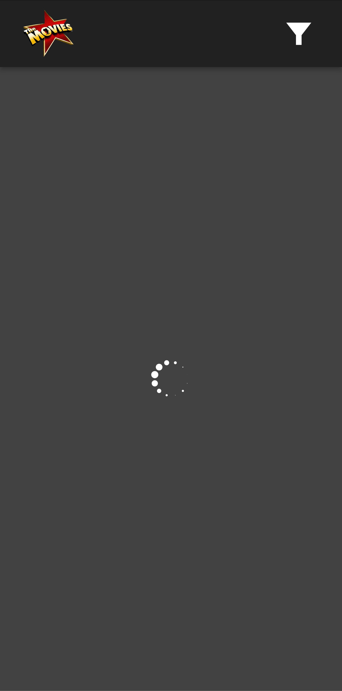
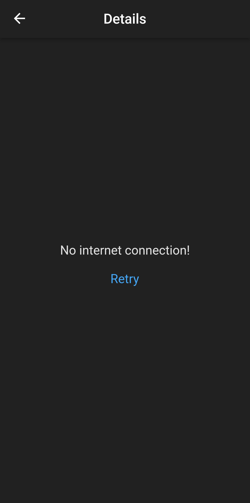

# App overview

## Tratamento de erros

O app oferece os seguintes tratamentos de erros:
- Excessões relacionadas a conectividade são reportadas ao usuário com a mensagem 'No internet connection'
- Outros tipos de excessões são reportadas através da mensagem 'We are having some dificulties, please try again later'
- Campos nulos ou strings vazias fornecidos pela API são omitidos durante a exibição das informações
- Posters que falham em carregar são substituídos por uma imagem placeholder

## Armazenamento em cache

Inicialmente, o app mantém em cache apenas as informações necessárias para o 'preview' dos filmes. As informações completas de cada filme são baixadas e armazenadas em cache a medida que o usuário acessa cada um dos filmes.

## Organização das classes e arquitetura

A arquitetura utilizada foi a MVC. Dessa forma, as classes podem ser divididas em três categorias:

### Views
Compreendem todas as classes de widgets. Encarregam-se apenas de solicitar e exibir as informações fornecidas pelo controlador, e exibir as telas de carregamento ou de erro nos momentos adequados.
- Classes: homeScreen; detailsScreen; movieCard; loadingScreen; failedToLoadScreen; filterMenu

### Controler
Encarregado de fazer a interface entre as vies e as classes representadoras de dados. Solicita aos models as informações solicitadas pelas views, e faz os pré-processamentos adequados para deixar a informação crua num formato que os views possam simplesmente ler e exibir. Também é encarregado de filtrar os filmes se a filtragem por gênero está ativa
- Classes: Controller

### Models
Representam os dados. A classe 'movie' representa um filme e contem propriedades ondeserão armazenadas todas as informações de um filme. A classe 'movieCatalog' é responsável por manter e administrar os filmes salvos em cache, além de solicitar informações adicionais de filmes que ainda não constam em cache. A classe 'dataFetcher' é a responsavel por fazer a comuicação com a API

## Screenshots

<table style="border-color: white">
 <tr>
    <td><b style="font-size:20px">Tela inicial</b></td>
    <td style="padding-left: 5em"><b style="font-size:20px">Menu de seleção de filtro</b></td>
 </tr>
 <tr>
    <td></td>
    <td style="padding-left: 5em"></td>
 </tr>
 <tr style="padding-bottom: 5em">
    <td style="padding-bottom: 5em">Exibe uma visão resumida de todos os filmes</td>
    <td style="padding-left: 5em; padding-bottom: 5em">Usado pelo usuário para selecionar os generos dos filmes que serão exibidos</td>
 </tr>
 </tr>
 <!-- 2nd row -->
 <tr>
    <td><b style="font-size:20px">Tela inicial com filtragem aplicada</b></td>
    <td style="padding-left: 5em"><b style="font-size:20px">Tela de detalhes</b></td>
 </tr>
 <tr>
    <td></td>
    <td style="padding-left: 5em"></td>
 </tr>
 <tr>
    <td style="padding-bottom: 5em">Tela inicial depois de ter sido aplicado um filtro através do menu de filtragem</td>
    <td style="padding-left: 5em; padding-bottom: 5em">Exibe uma visão detalhada do filme selecionado</td>
 </tr>
 <!-- 3rd row -->
 <tr>
    <td><b style="font-size:20px; padding-top: 5em">Tela de carregamento</b></td>
    <td style="padding-left: 5em"><b style="font-size:20px">Tela de erro</b></td>
 </tr>
 <tr>
    <td></td>
    <td style="padding-left: 5em"></td>
 </tr>
 <tr>
    <td>Exibida enquanto as informações são carregadas</td>
    <td style="padding-left: 5em">Exibida caso ocorra um erro</td>
 </tr>
</table>
